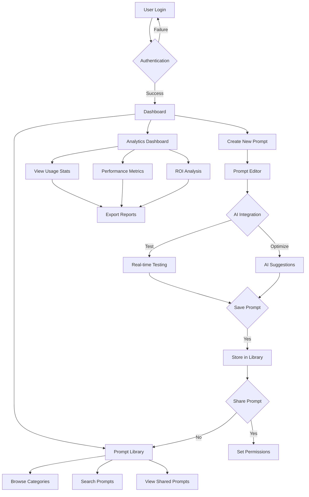
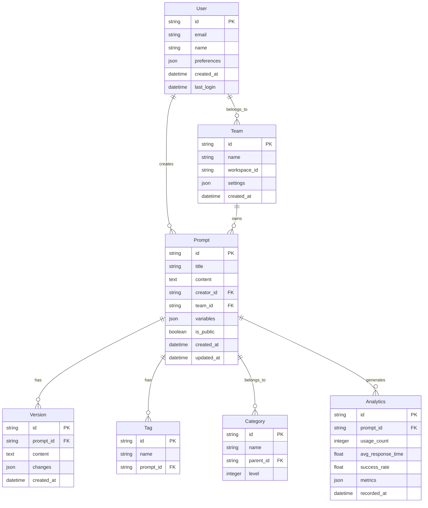
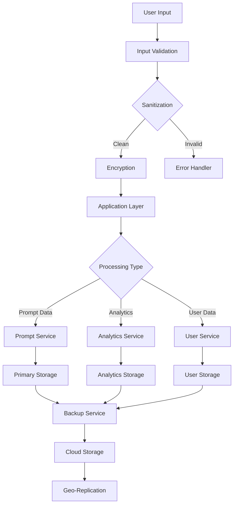
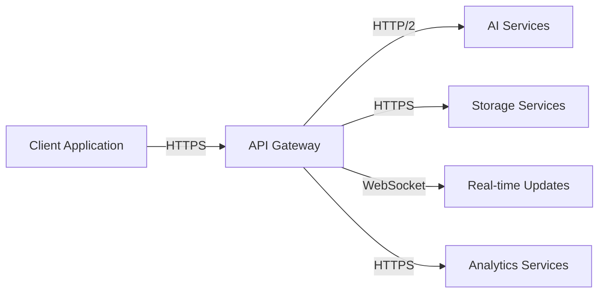

# Product Requirements Document (PRD)

# 1. INTRODUCTION

## 1.1 Purpose
This Software Requirements Specification (SRS) document provides a comprehensive description of the Prompts Portal platform. It details the functional and non-functional requirements for developers, project managers, and stakeholders involved in the development and implementation of the system. This document will serve as the primary reference for technical and non-technical audiences throughout the development lifecycle.

## 1.2 Scope
The Prompts Portal is a centralized web-based platform designed to create, manage, and optimize prompts for artificial intelligence tools such as ChatGPT, Google Bard, and similar language models. The system encompasses:

- A comprehensive prompt library with categorization and customization capabilities
- An intuitive prompt editor with AI-powered optimization suggestions
- Collaboration features for sharing and managing prompts across teams
- Analytics and performance tracking functionality
- Direct integration with major AI model APIs
- Secure authentication and user management

Key benefits include:
- Streamlined prompt management and optimization
- Enhanced team collaboration and knowledge sharing
- Improved operational efficiency through standardized AI interactions
- Data-driven insights for prompt effectiveness
- Cost reduction through optimized AI model usage

The platform will be built using modern web technologies and cloud infrastructure, leveraging either Azure or Google Cloud Platform for hosting and scalability, with OAuth 2.0 for authentication and cloud storage solutions for data management.

# 2. PRODUCT DESCRIPTION

## 2.1 Product Perspective
The Prompts Portal operates as a standalone web application while integrating with various external AI services and systems. The platform fits into the broader AI tooling ecosystem by:

- Interfacing directly with major AI model APIs (OpenAI, Anthropic, Google)
- Operating within cloud infrastructure (Azure/GCP) for scalability and reliability
- Utilizing OAuth 2.0 for secure authentication
- Integrating with analytics platforms (Google Analytics, Mixpanel/Amplitude)
- Leveraging cloud storage solutions for data persistence

## 2.2 Product Functions
The core functions of the Prompts Portal include:

1. Prompt Management
   - Creation and editing of AI prompts
   - Categorization and tagging system
   - Version control and history tracking
   - Dynamic variable and placeholder support

2. Collaboration Features
   - Team-based sharing and access controls
   - Collaborative editing capabilities
   - Permission management
   - Knowledge base creation

3. Analytics and Optimization
   - Performance metrics tracking
   - Usage statistics and reporting
   - AI-powered improvement suggestions
   - ROI and efficiency measurements

4. Integration Capabilities
   - Direct API connections to AI models
   - Real-time prompt testing
   - Bulk import/export functionality
   - Custom API integrations

## 2.3 User Characteristics
The platform caters to three primary user personas:

1. AI Practitioners
   - Technical expertise: High
   - Needs: Advanced prompt engineering, optimization tools
   - Usage: Daily, intensive prompt development

2. Business Users
   - Technical expertise: Medium to Low
   - Needs: Ready-to-use prompts, simple interface
   - Usage: Regular task automation, content generation

3. Team Managers
   - Technical expertise: Medium
   - Needs: Oversight, analytics, team management
   - Usage: Monitoring, resource allocation, strategy

## 2.4 Constraints
1. Technical Constraints
   - Must operate within API rate limits of AI providers
   - Browser compatibility requirements
   - Mobile responsiveness requirements
   - Maximum response time of 2 seconds for core functions

2. Business Constraints
   - Compliance with data protection regulations
   - Authentication security standards
   - Scalability requirements for enterprise clients
   - Budget limitations for cloud services

3. Security Constraints
   - OAuth 2.0 implementation requirements
   - Data encryption standards
   - Access control mechanisms
   - Regular security audits

## 2.5 Assumptions and Dependencies
Assumptions:
- Users have stable internet connectivity
- AI service providers maintain consistent APIs
- Browser support for modern web technologies
- Users have basic understanding of prompt engineering

Dependencies:
- Availability of third-party AI services
- Cloud platform services (Azure/GCP)
- Analytics services (Google Analytics, Mixpanel/Amplitude)
- OAuth 2.0 authentication providers
- Cloud storage services for data management

# 3. PROCESS FLOWCHART



# 4. FUNCTIONAL REQUIREMENTS

## 4.1 Prompt Management System

### ID: FR-PM
### Description
Core functionality for creating, editing, and managing AI prompts with version control and categorization.
### Priority: High

| Requirement ID | Description | Acceptance Criteria |
|---------------|-------------|-------------------|
| FR-PM-01 | Create new prompts with rich text editor | - Support markdown formatting<br>- Allow variable placeholders<br>- Preview functionality |
| FR-PM-02 | Categorize prompts with tags and folders | - Multiple tag support<br>- Nested folder structure<br>- Bulk categorization |
| FR-PM-03 | Version control system | - Track changes<br>- Restore previous versions<br>- Compare versions |
| FR-PM-04 | Prompt templates library | - Pre-built templates by category<br>- Custom template creation<br>- Template import/export |

## 4.2 Collaboration Features

### ID: FR-CF
### Description
Team-based sharing and collaboration capabilities with granular access controls.
### Priority: Medium

| Requirement ID | Description | Acceptance Criteria |
|---------------|-------------|-------------------|
| FR-CF-01 | Share prompts with team members | - Individual and group sharing<br>- Public/private options<br>- Link sharing |
| FR-CF-02 | Permission management | - Role-based access control<br>- Custom permission sets<br>- Inheritance rules |
| FR-CF-03 | Collaborative editing | - Real-time collaboration<br>- Change tracking<br>- Comment system |
| FR-CF-04 | Team workspaces | - Separate workspace per team<br>- Resource allocation<br>- Activity feeds |

## 4.3 Analytics and Optimization

### ID: FR-AO
### Description
Performance tracking and AI-powered optimization suggestions.
### Priority: Medium

| Requirement ID | Description | Acceptance Criteria |
|---------------|-------------|-------------------|
| FR-AO-01 | Usage analytics | - Track prompt usage<br>- Response times<br>- Success rates |
| FR-AO-02 | AI optimization suggestions | - Language improvements<br>- Structure optimization<br>- Performance recommendations |
| FR-AO-03 | ROI tracking | - Cost per prompt<br>- Time savings metrics<br>- Efficiency reports |
| FR-AO-04 | Custom reporting | - Report builder<br>- Export options<br>- Scheduled reports |

## 4.4 Integration System

### ID: FR-IS
### Description
Direct connections with AI models and external systems.
### Priority: High

| Requirement ID | Description | Acceptance Criteria |
|---------------|-------------|-------------------|
| FR-IS-01 | AI model integration | - OpenAI API connection<br>- Anthropic API connection<br>- Google API connection |
| FR-IS-02 | Real-time testing | - Live preview<br>- Response validation<br>- Error handling |
| FR-IS-03 | Bulk operations | - Import/export functionality<br>- Batch processing<br>- Data validation |
| FR-IS-04 | Custom API support | - API key management<br>- Custom endpoint configuration<br>- Rate limiting |

## 4.5 User Management

### ID: FR-UM
### Description
Authentication, authorization, and user profile management.
### Priority: High

| Requirement ID | Description | Acceptance Criteria |
|---------------|-------------|-------------------|
| FR-UM-01 | OAuth 2.0 authentication | - Multiple provider support<br>- Token management<br>- SSO integration |
| FR-UM-02 | User profiles | - Custom preferences<br>- Activity history<br>- Settings management |
| FR-UM-03 | Team management | - Create/edit teams<br>- Member management<br>- Role assignment |
| FR-UM-04 | Audit logging | - User actions tracking<br>- Security events<br>- Compliance reporting |

# 5. NON-FUNCTIONAL REQUIREMENTS

## 5.1 Performance Requirements

| Requirement ID | Description | Target Metric |
|---------------|-------------|---------------|
| NFR-P-01 | Page Load Time | Initial page load < 3 seconds |
| NFR-P-02 | API Response Time | 95% of API requests < 2 seconds |
| NFR-P-03 | Concurrent Users | Support 1000+ simultaneous users |
| NFR-P-04 | Resource Usage | CPU utilization < 70% under normal load |
| NFR-P-05 | Database Performance | Query response time < 500ms |

## 5.2 Safety Requirements

| Requirement ID | Description | Implementation |
|---------------|-------------|----------------|
| NFR-S-01 | Data Backup | Automated daily backups with 30-day retention |
| NFR-S-02 | Failure Recovery | System recovery time < 4 hours |
| NFR-S-03 | Error Handling | Graceful degradation of services |
| NFR-S-04 | Data Validation | Input sanitization and validation checks |
| NFR-S-05 | Monitoring | Real-time system health monitoring |

## 5.3 Security Requirements

| Requirement ID | Description | Implementation |
|---------------|-------------|----------------|
| NFR-SE-01 | Authentication | OAuth 2.0 with MFA support |
| NFR-SE-02 | Data Encryption | AES-256 encryption at rest and in transit |
| NFR-SE-03 | Access Control | Role-based access control (RBAC) |
| NFR-SE-04 | API Security | Rate limiting and API key management |
| NFR-SE-05 | Audit Logging | Comprehensive security event logging |

## 5.4 Quality Requirements

### 5.4.1 Availability
- System uptime: 99.9%
- Planned maintenance windows: Monthly, off-peak hours
- Redundancy: Multi-region deployment

### 5.4.2 Maintainability
- Modular architecture
- Comprehensive documentation
- Automated testing coverage > 80%
- CI/CD pipeline integration

### 5.4.3 Usability
- Mobile-responsive design
- WCAG 2.1 Level AA compliance
- Maximum 3 clicks to reach any feature
- Intuitive navigation structure

### 5.4.4 Scalability
- Horizontal scaling capability
- Auto-scaling based on load
- Database sharding support
- CDN integration for static content

### 5.4.5 Reliability
- Mean Time Between Failures (MTBF): > 720 hours
- Mean Time To Recovery (MTTR): < 4 hours
- Error rate: < 0.1% of all transactions

## 5.5 Compliance Requirements

| Requirement ID | Description | Standard/Regulation |
|---------------|-------------|-------------------|
| NFR-C-01 | Data Protection | GDPR, CCPA compliance |
| NFR-C-02 | Accessibility | WCAG 2.1 Level AA |
| NFR-C-03 | Security Standards | SOC 2 Type II compliance |
| NFR-C-04 | API Standards | OpenAPI Specification 3.0 |
| NFR-C-05 | Cloud Security | CSA STAR certification |

# 6. DATA REQUIREMENTS

## 6.1 Data Models



## 6.2 Data Storage

### 6.2.1 Primary Storage
- Cloud-native database solution using Azure Cosmos DB or Google Cloud Firestore
- Document-based storage for flexible schema evolution
- Multi-region replication for high availability
- Automatic scaling based on demand

### 6.2.2 Data Retention
- Active prompt data: Indefinite retention
- Analytics data: 24 months rolling retention
- User activity logs: 12 months retention
- Audit logs: 36 months retention
- Deleted items: Soft deletion with 30-day recovery window

### 6.2.3 Backup and Recovery
- Automated daily full backups
- Point-in-time recovery capability up to 30 days
- Cross-region backup replication
- Recovery Time Objective (RTO): 4 hours
- Recovery Point Objective (RPO): 1 hour

## 6.3 Data Processing



### 6.3.1 Data Security
- AES-256 encryption for data at rest
- TLS 1.3 for data in transit
- Field-level encryption for sensitive data
- Key rotation every 90 days
- Regular security audits and penetration testing

### 6.3.2 Data Processing Rules
- Real-time data validation and sanitization
- Asynchronous processing for analytics data
- Rate limiting for API requests
- Batch processing for bulk operations
- Data compression for large datasets

### 6.3.3 Data Integration
- REST API endpoints with OpenAPI 3.0 specification
- Webhook support for real-time data updates
- Batch import/export capabilities
- ETL pipelines for analytics data
- API rate limiting and throttling controls

# 7. EXTERNAL INTERFACES

## 7.1 User Interfaces

### 7.1.1 Web Application Interface
- Responsive design supporting desktop (1920x1080) to mobile (320x568) resolutions
- Material Design 3 or Tailwind CSS framework for consistent UI components
- Dark/light theme support with system preference detection
- Maximum load time of 3 seconds for initial page render
- WCAG 2.1 Level AA compliance for accessibility

### 7.1.2 Key Interface Components

| Component | Requirements |
|-----------|--------------|
| Navigation | - Persistent top navigation bar<br>- Collapsible side menu for categories<br>- Breadcrumb navigation |
| Prompt Editor | - Rich text editing capabilities<br>- Split-screen preview mode<br>- Variable placeholder insertion tools<br>- Syntax highlighting |
| Dashboard | - Customizable widget layout<br>- Real-time analytics displays<br>- Interactive charts and graphs |
| Search Interface | - Global search functionality<br>- Advanced filtering options<br>- Type-ahead suggestions |

## 7.2 Software Interfaces

### 7.2.1 AI Model Integrations

| Service | Interface Type | Protocol | Data Format |
|---------|---------------|----------|-------------|
| OpenAI API | REST | HTTPS | JSON |
| Anthropic API | REST | HTTPS | JSON |
| Google AI API | gRPC | HTTP/2 | Protocol Buffers |

### 7.2.2 Cloud Services

| Service | Purpose | Protocol |
|---------|----------|----------|
| Azure Cosmos DB/Cloud Firestore | Primary data storage | HTTPS |
| Azure Blob/Google Cloud Storage | File storage | HTTPS |
| Azure CDN/Google Cloud CDN | Content delivery | HTTPS |

### 7.2.3 Analytics Services

| Service | Integration Type | Data Format |
|---------|-----------------|-------------|
| Google Analytics | JavaScript SDK | JSON |
| Mixpanel/Amplitude | REST API | JSON |
| Custom Analytics | GraphQL | JSON |

## 7.3 Communication Interfaces

### 7.3.1 Network Protocols

| Protocol | Usage | Port |
|----------|-------|------|
| HTTPS | Secure web traffic | 443 |
| WebSocket | Real-time updates | 443 |
| HTTP/2 | API communications | 443 |

### 7.3.2 API Specifications

```yaml
openapi: 3.0.0
paths:
  /api/v1/prompts:
    get:
      security:
        - OAuth2: [read]
      responses:
        '200':
          content:
            application/json
    post:
      security:
        - OAuth2: [write]
      requestBody:
        content:
          application/json
  /api/v1/analytics:
    get:
      security:
        - OAuth2: [read]
      responses:
        '200':
          content:
            application/json
```

### 7.3.3 Integration Patterns



# 8. APPENDICES

## 8.1 Additional Information
- Learning capabilities from uploaded documents were not detailed in main sections
- Frontend monitoring through Google Analytics integration details
- User engagement tracking via Mixpanel/Amplitude specifics
- Dynamic variable and placeholder support implementation details
- Heroku deployment option for prototyping phase

## 8.2 Glossary

| Term | Definition |
|------|------------|
| Prompt Engineering | The practice of designing and optimizing input prompts for AI language models to achieve desired outputs |
| Workspace | A dedicated environment within the platform for a specific team or organization |
| Template | Pre-defined prompt structure that can be customized for specific use cases |
| Token | The basic unit of text processing in AI language models |
| Placeholder | Dynamic variable in a prompt template that can be replaced with specific values |
| Rate Limiting | Controlling the number of API requests within a specified time period |

## 8.3 Acronyms

| Acronym | Definition |
|---------|------------|
| API | Application Programming Interface |
| CDN | Content Delivery Network |
| ETL | Extract, Transform, Load |
| GCP | Google Cloud Platform |
| KPI | Key Performance Indicator |
| MFA | Multi-Factor Authentication |
| MTBF | Mean Time Between Failures |
| MTTR | Mean Time To Recovery |
| RBAC | Role-Based Access Control |
| ROI | Return on Investment |
| SRS | Software Requirements Specification |
| SSO | Single Sign-On |
| TLS | Transport Layer Security |
| WCAG | Web Content Accessibility Guidelines |

## 8.4 Additional References

| Resource | Description | URL |
|----------|-------------|-----|
| OpenAI API Documentation | Reference for OpenAI API integration | https://platform.openai.com/docs |
| OAuth 2.0 Specification | Authentication protocol documentation | https://oauth.net/2/ |
| Material Design Guidelines | UI/UX design principles | https://m3.material.io/ |
| WCAG 2.1 Guidelines | Web accessibility standards | https://www.w3.org/WAI/WCAG21/quickref/ |
| Azure Documentation | Cloud platform documentation | https://docs.microsoft.com/azure |
| Google Cloud Documentation | Cloud platform documentation | https://cloud.google.com/docs |