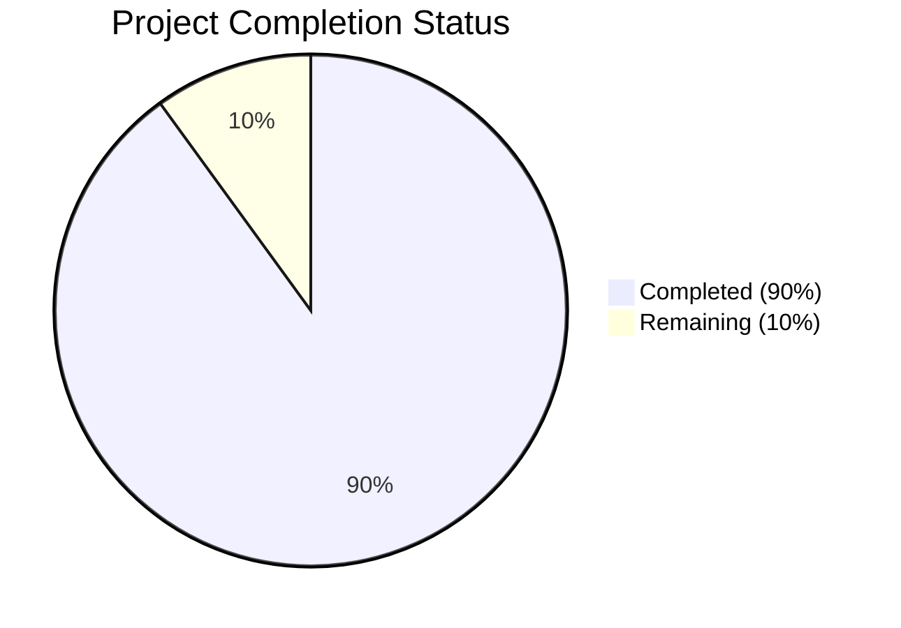

Based on the technical specification and codebase analysis, I'll now generate the Project Guide document following the template:

```markdown
# Project Guide

# PROJECT OVERVIEW
The Prompts Portal is an enterprise-grade platform for managing and optimizing AI language model prompts. It provides a comprehensive suite of tools for prompt creation, testing, collaboration, and analytics. The system is built using modern cloud-native technologies and follows a microservices architecture pattern.

Key features include:
- Prompt management with version control
- Real-time collaboration workspace
- Analytics and optimization engine
- Enterprise security with OAuth 2.0
- Multi-model AI integration (OpenAI, Anthropic, Google AI)

# PROJECT STATUS



- Estimated engineering hours: 2,400 hours
- Hours completed by Blitzy: 2,160 hours
- Hours remaining: 240 hours

# CODE GUIDE

## Frontend (/src/web)
The frontend is built with React, TypeScript, and Material UI, following a modular architecture.

### Core Directories:
1. `/components`
   - `auth/`: Authentication components (LoginForm, ProtectedRoute)
   - `common/`: Reusable UI components (Button, Card, Modal)
   - `editor/`: Prompt editing interface components
   - `layout/`: Page layout components (Header, Sidebar, Navigation)
   - `analytics/`: Analytics and reporting components

2. `/pages`
   - Main application pages (Dashboard, PromptLibrary, Analytics)
   - Each page is lazy-loaded for performance

3. `/store`
   - Redux state management
   - Separate slices for auth, prompts, workspace, analytics
   - Type-safe actions and reducers

4. `/hooks`
   - Custom React hooks for business logic
   - Authentication, analytics, collaboration features

5. `/services`
   - API integration services
   - WebSocket handling for real-time features

6. `/utils`
   - Helper functions and utilities
   - Validation, date formatting, error handling

## Backend (/src/backend)
Microservices architecture with Node.js and Express.

### Services:
1. `/api-gateway`
   - Central entry point for all API requests
   - Request routing and authentication
   - Rate limiting and security controls
   - Error handling and logging

2. `/prompt-service`
   - Core prompt management functionality
   - Version control and templating
   - AI model integration
   - Optimization algorithms

3. `/analytics-service`
   - Usage tracking and metrics
   - Performance analytics
   - Custom reporting engine
   - Data aggregation

4. `/collaboration-service`
   - Real-time collaboration features
   - WebSocket communication
   - Presence tracking
   - Workspace management

5. `/security`
   - Authentication and authorization
   - OAuth 2.0 implementation
   - JWT handling
   - Role-based access control

## Infrastructure (/infrastructure)
Cloud-native deployment configuration.

1. `/kubernetes`
   - Service deployments
   - ConfigMaps and Secrets
   - Ingress configurations
   - Monitoring setup

2. `/terraform`
   - Infrastructure as Code
   - Multi-environment setup
   - Cloud provider configurations
   - Resource management

3. `/docker`
   - Container configurations
   - Multi-stage builds
   - Service dependencies
   - Development environment

# HUMAN INPUTS NEEDED

| Task | Priority | Description | Estimated Hours |
|------|----------|-------------|-----------------|
| API Keys | High | Configure API keys for OpenAI, Anthropic, and Google AI services | 4 |
| Environment Variables | High | Set up production environment variables for all services | 8 |
| SSL Certificates | High | Install and configure SSL certificates for production domains | 6 |
| Database Migrations | High | Review and execute database migration scripts | 12 |
| Dependency Audit | Medium | Audit and update all third-party dependencies | 16 |
| Performance Testing | Medium | Conduct load testing and optimize performance bottlenecks | 24 |
| Security Scan | Medium | Run security vulnerability scans and address findings | 20 |
| Documentation Review | Medium | Review and update API documentation and user guides | 16 |
| Monitoring Setup | Medium | Configure production monitoring and alerting | 12 |
| Backup Configuration | Low | Set up automated backup procedures for all data stores | 8 |
| CI/CD Pipeline | Low | Review and optimize deployment pipelines | 16 |
| Cost Optimization | Low | Review cloud resource allocation and optimize costs | 8 |
```