# Technical Specifications

# 1. INTRODUCTION

## 1.1 EXECUTIVE SUMMARY

The Prompts Portal is a centralized web-based platform designed to revolutionize how organizations create, manage, and optimize prompts for AI language models. By addressing the growing need for standardized and efficient prompt engineering, the platform enables businesses to maximize their AI investments through improved prompt quality, collaboration, and measurable outcomes.

The system serves AI practitioners, business users, and team managers by providing a comprehensive suite of tools for prompt creation, testing, and analytics. With an expected ROI driven by reduced prompt development time, improved AI response quality, and enhanced team collaboration, the Prompts Portal positions itself as a critical enterprise tool in the AI toolchain.

## 1.2 SYSTEM OVERVIEW

### Project Context

| Aspect | Description |
|--------|-------------|
| Market Position | First-to-market enterprise-grade prompt management platform |
| Current Limitations | Fragmented prompt management, lack of standardization, inefficient collaboration |
| Enterprise Integration | Seamless integration with existing AI infrastructure and authentication systems |

### High-Level Description

The system architecture employs cloud-native technologies with these core components:

- Prompt Management Engine with version control and templating
- Real-time AI model integration layer
- Analytics and optimization engine
- Collaborative workspace environment
- Enterprise-grade security and authentication

Technical approach leverages:
- Cloud infrastructure (Azure/GCP)
- OAuth 2.0 authentication
- RESTful APIs
- Real-time WebSocket communications
- Document-based storage

### Success Criteria

| Category | Metrics |
|----------|---------|
| User Adoption | - 80% team engagement within 3 months<br>- 50% reduction in prompt creation time |
| Performance | - 99.9% system uptime<br>- < 2 second response time for core functions |
| Business Impact | - 30% improvement in AI response quality<br>- 40% reduction in prompt-related costs |

## 1.3 SCOPE

### In-Scope Elements

#### Core Features and Functionalities

| Feature Category | Components |
|-----------------|------------|
| Prompt Management | - Creation and editing tools<br>- Version control<br>- Template library<br>- AI-powered optimization |
| Collaboration | - Team workspaces<br>- Sharing capabilities<br>- Permission management<br>- Real-time collaboration |
| Analytics | - Usage tracking<br>- Performance metrics<br>- ROI calculations<br>- Custom reporting |
| Integration | - OpenAI API<br>- Anthropic API<br>- Google AI API<br>- Custom API support |

#### Implementation Boundaries

| Boundary Type | Coverage |
|--------------|----------|
| User Groups | - AI practitioners<br>- Business users<br>- Team managers |
| Geographic Coverage | - Global deployment<br>- Multi-region support |
| Data Domains | - Prompt content<br>- Usage analytics<br>- User data<br>- Performance metrics |

### Out-of-Scope Elements

- Custom AI model development
- Natural language processing services
- Content generation services
- Third-party marketplace integration
- Mobile native applications
- Offline functionality
- Training and certification programs
- Custom AI model hosting

Future phase considerations:
- Advanced AI model fine-tuning
- Marketplace for prompt sharing
- Mobile app development
- Advanced automation workflows
- Custom model integration platform

# 2. SYSTEM ARCHITECTURE

## 2.1 High-Level Architecture

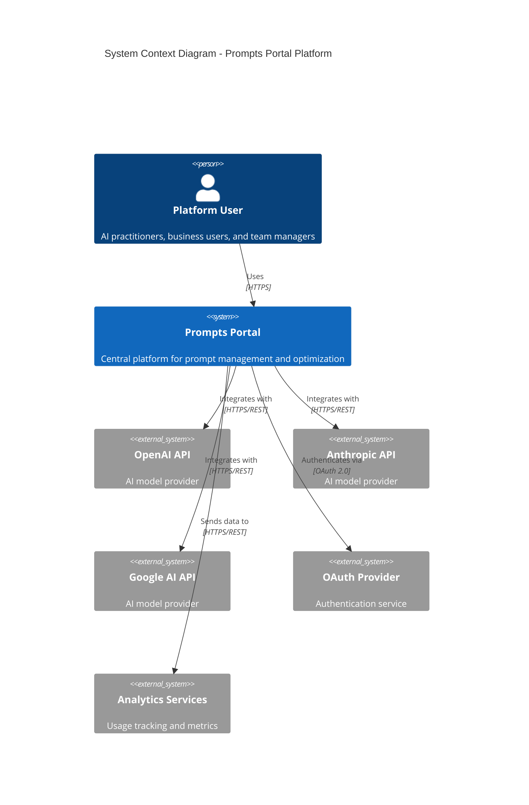

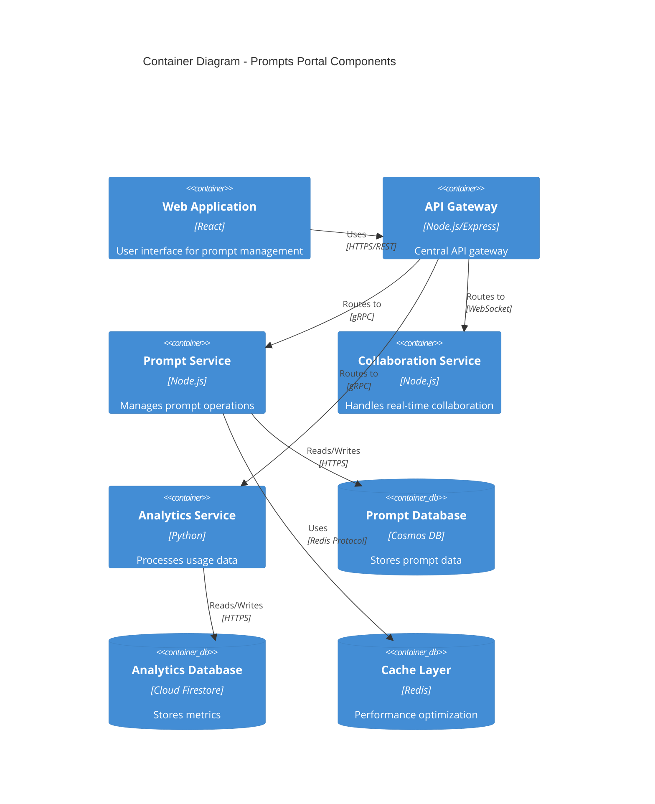

## 2.2 Component Details

### 2.2.1 Core Components

| Component | Purpose | Technology Stack | Scaling Strategy |
|-----------|---------|-----------------|------------------|
| Web Application | User interface | React, TypeScript, Material UI | Horizontal scaling with CDN |
| API Gateway | Request routing and auth | Node.js, Express | Auto-scaling with load balancers |
| Prompt Service | Prompt management | Node.js, gRPC | Horizontal pod autoscaling |
| Collaboration Service | Real-time features | Node.js, Socket.io | Pod scaling based on connections |
| Analytics Service | Data processing | Python, pandas | Event-driven auto-scaling |

### 2.2.2 Data Storage

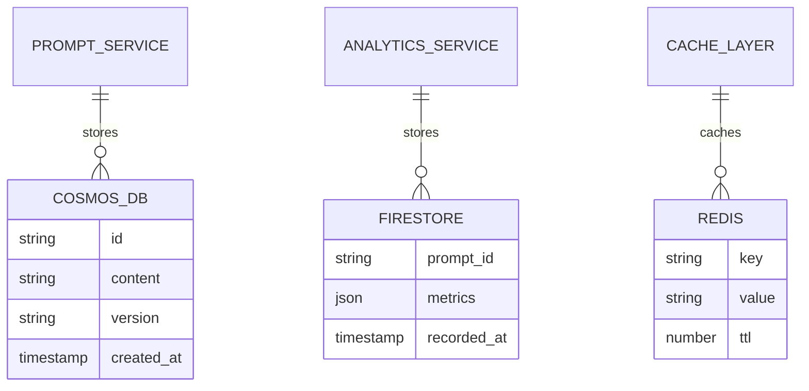

## 2.3 Technical Decisions

### 2.3.1 Architecture Patterns

| Pattern | Implementation | Justification |
|---------|---------------|---------------|
| Microservices | Domain-driven service boundaries | Scalability and maintainability |
| Event-driven | Message queues for async operations | Decoupling and reliability |
| CQRS | Separate read/write operations | Performance optimization |
| API Gateway | Centralized routing and auth | Security and monitoring |

### 2.3.2 Communication Patterns

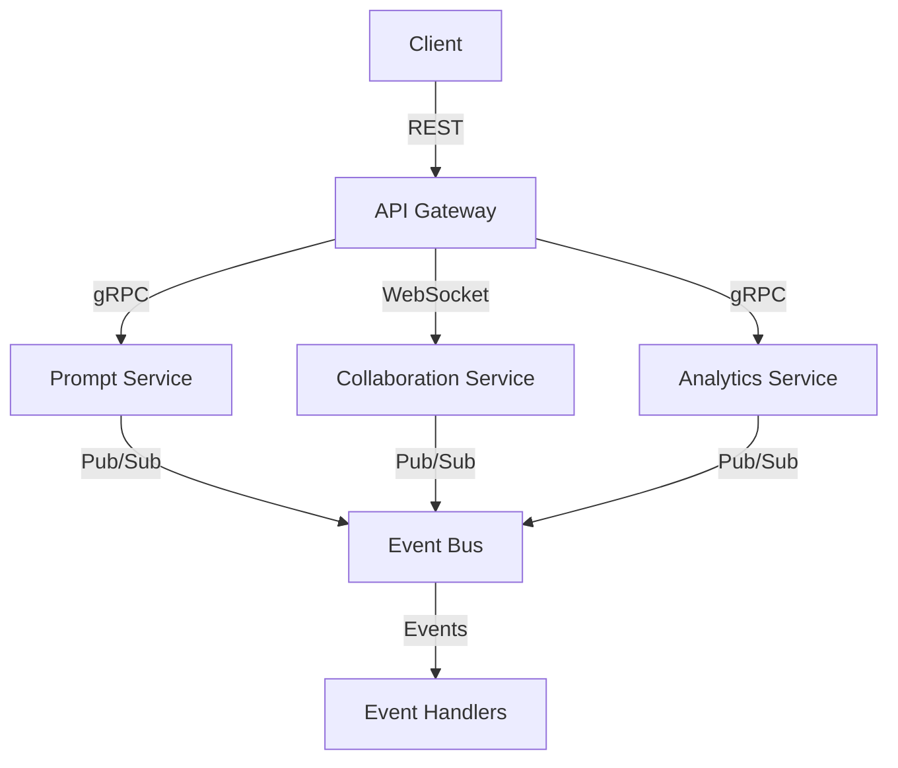

## 2.4 Cross-Cutting Concerns

### 2.4.1 Monitoring and Observability

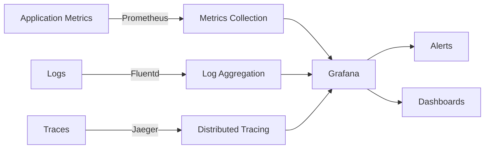

### 2.4.2 Security Architecture

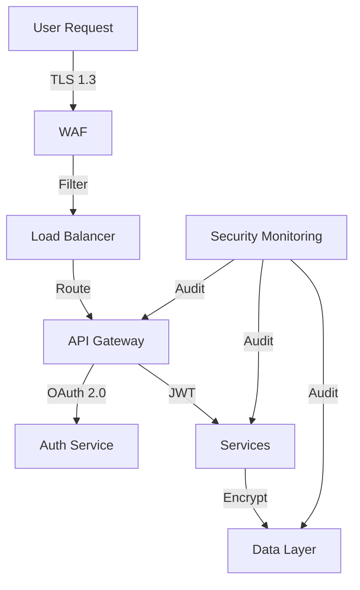

## 2.5 Deployment Architecture

```mermaid
C4Deployment
    title Deployment Diagram - Cloud Infrastructure

    Deployment_Node(cdn, "CDN", "Global Edge Network"){
        Container(static, "Static Assets", "CDN-distributed content")
    }
    
    Deployment_Node(cloud, "Cloud Platform", "Azure/GCP"){
        Deployment_Node(k8s, "Kubernetes Cluster"){
            Container(services, "Microservices", "Container pods")
        }
        
        Deployment_Node(data, "Data Layer"){
            ContainerDb(cosmos, "Cosmos DB", "Document storage")
            ContainerDb(redis, "Redis Cluster", "Caching layer")
        }
        
        Deployment_Node(monitoring, "Monitoring"){
            Container(metrics, "Metrics Stack", "Prometheus/Grafana")
            Container(logging, "Logging Stack", "ELK Stack")
        }
    }

    Rel(cdn, k8s, "Routes to", "HTTPS")
    Rel(k8s, data, "Persists to", "Internal network")
    Rel(k8s, monitoring, "Reports to", "Internal network")
```

# 3. SYSTEM COMPONENTS ARCHITECTURE

## 3.1 USER INTERFACE DESIGN

### 3.1.1 Design Specifications

| Aspect | Requirements |
|--------|--------------|
| Visual Hierarchy | - F-pattern layout for content scanning<br>- Z-pattern for landing pages<br>- Maximum 3 levels of information hierarchy |
| Design System | - Material Design 3.0 components<br>- Custom prompt-specific components<br>- Consistent spacing (8px grid system) |
| Responsive Design | - Breakpoints: 320px, 768px, 1024px, 1440px<br>- Mobile-first approach<br>- Fluid typography (16px base) |
| Accessibility | - WCAG 2.1 Level AA compliance<br>- ARIA landmarks and labels<br>- Keyboard navigation support |
| Browser Support | - Chrome 90+<br>- Firefox 88+<br>- Safari 14+<br>- Edge 90+ |
| Theme Support | - System-detected dark/light modes<br>- Custom theme options<br>- High contrast mode |
| i18n/l10n | - RTL support<br>- Unicode compliance<br>- Dynamic content translation |

### 3.1.2 Interface Elements

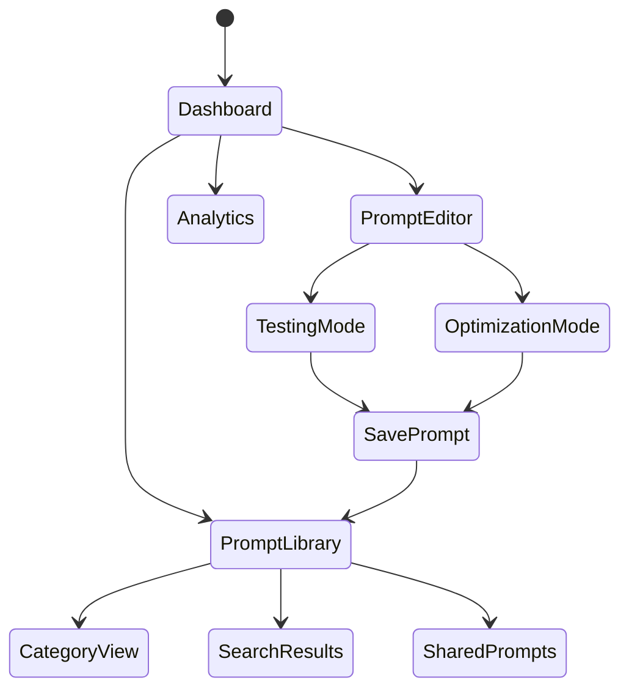

### 3.1.3 Critical User Flows

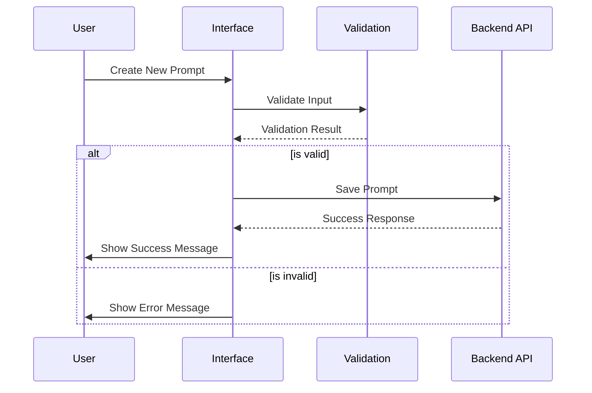

## 3.2 DATABASE DESIGN

### 3.2.1 Schema Design

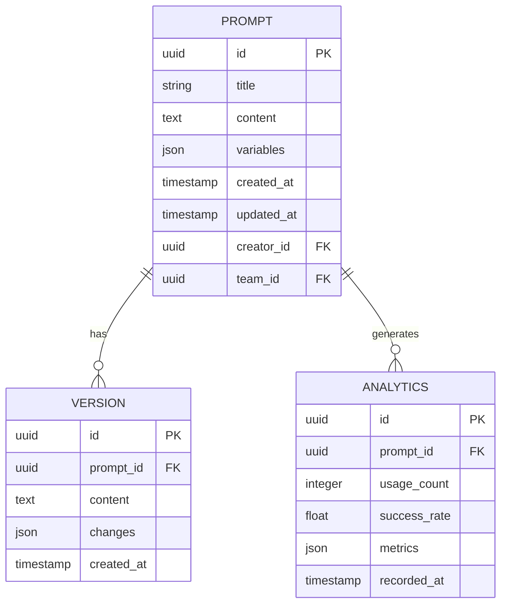

### 3.2.2 Data Management Strategy

| Component | Strategy |
|-----------|----------|
| Migrations | - Versioned migrations with rollback support<br>- Blue-green deployment approach<br>- Zero-downtime updates |
| Versioning | - Semantic versioning for schema changes<br>- Change tracking with audit logs<br>- Schema version registry |
| Archival | - Automated archival after 12 months inactivity<br>- Compressed storage format<br>- Queryable archive storage |
| Retention | - Active data: 24 months<br>- Analytics data: 36 months<br>- Audit logs: 7 years |
| Privacy | - Field-level encryption<br>- Data anonymization<br>- GDPR compliance tools |

### 3.2.3 Performance Optimization

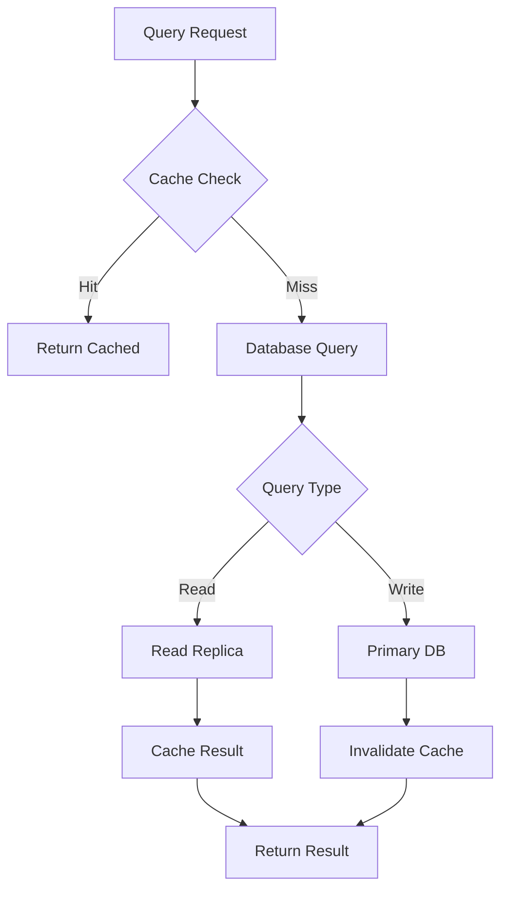

## 3.3 API DESIGN

### 3.3.1 API Architecture

| Component | Specification |
|-----------|--------------|
| Protocol | REST over HTTPS/2 |
| Authentication | OAuth 2.0 with JWT |
| Rate Limiting | - 1000 requests/hour per user<br>- 5000 requests/hour per team |
| Versioning | URI-based (/v1/, /v2/) |
| Documentation | OpenAPI 3.0 Specification |

### 3.3.2 Interface Specifications

```yaml
openapi: 3.0.0
paths:
  /v1/prompts:
    get:
      security:
        - OAuth2: [read]
      parameters:
        - name: category
          in: query
          schema:
            type: string
      responses:
        '200':
          description: Success
          content:
            application/json:
              schema:
                type: array
                items:
                  $ref: '#/components/schemas/Prompt'
    post:
      security:
        - OAuth2: [write]
      requestBody:
        required: true
        content:
          application/json:
            schema:
              $ref: '#/components/schemas/PromptCreate'
```

### 3.3.3 Integration Architecture

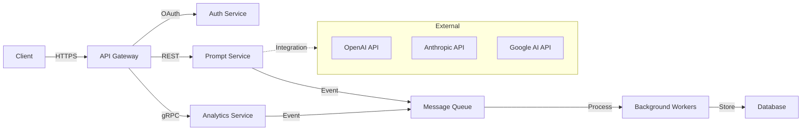

# 4. TECHNOLOGY STACK

## 4.1 PROGRAMMING LANGUAGES

| Platform/Component | Language | Version | Justification |
|-------------------|----------|---------|---------------|
| Frontend | TypeScript | 5.0+ | - Strong typing for enterprise-scale applications<br>- Enhanced IDE support<br>- Better maintainability |
| Backend Services | Node.js | 20 LTS | - Excellent async performance<br>- Rich ecosystem<br>- Consistent language across stack |
| Analytics Service | Python | 3.11+ | - Superior data processing capabilities<br>- ML/AI library ecosystem<br>- Optimized performance |
| Infrastructure | Go | 1.21+ | - Efficient systems programming<br>- Strong concurrency support<br>- Native cloud tooling |

## 4.2 FRAMEWORKS & LIBRARIES

### Core Frameworks

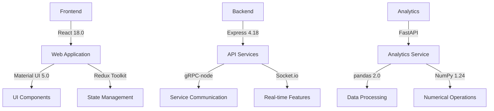

### Supporting Libraries

| Category | Library | Version | Purpose |
|----------|---------|---------|----------|
| Testing | Jest | 29.0+ | Frontend/Backend unit testing |
| Documentation | OpenAPI | 3.0 | API specification |
| Monitoring | Prometheus | 2.45+ | Metrics collection |
| Logging | Winston | 3.10+ | Centralized logging |

## 4.3 DATABASES & STORAGE

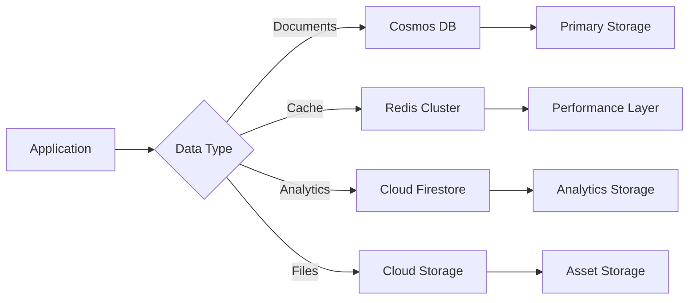

| Component | Technology | Version | Purpose |
|-----------|------------|---------|----------|
| Primary Database | Cosmos DB | Latest | Document storage with global distribution |
| Cache Layer | Redis | 7.0+ | High-performance data caching |
| Analytics Store | Cloud Firestore | Latest | Time-series and analytics data |
| Object Storage | Cloud Storage | Latest | File and backup storage |

## 4.4 THIRD-PARTY SERVICES

### Integration Architecture

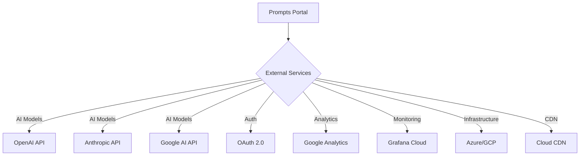

### Service Matrix

| Category | Service | Purpose | SLA |
|----------|---------|----------|-----|
| AI Integration | OpenAI API | LLM access | 99.9% |
| Authentication | OAuth 2.0 | User auth | 99.99% |
| Analytics | Google Analytics | Usage tracking | 99.9% |
| Monitoring | Grafana Cloud | System monitoring | 99.9% |

## 4.5 DEVELOPMENT & DEPLOYMENT

### Development Pipeline

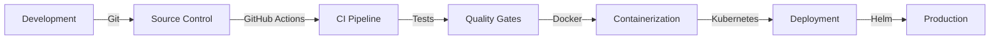

### Tools & Infrastructure

| Category | Tool | Version | Purpose |
|----------|------|---------|----------|
| IDE | VS Code | Latest | Development environment |
| Build | Webpack | 5.0+ | Asset bundling |
| Containers | Docker | 24.0+ | Application containerization |
| Orchestration | Kubernetes | 1.27+ | Container orchestration |
| CI/CD | GitHub Actions | Latest | Automation pipeline |

### Development Requirements

| Requirement | Specification |
|------------|---------------|
| Node.js | 20 LTS |
| Python | 3.11+ |
| Docker | 24.0+ |
| Kubernetes | 1.27+ |
| Git | 2.40+ |

# 5. SYSTEM DESIGN

## 5.1 USER INTERFACE DESIGN

### 5.1.1 Layout Structure

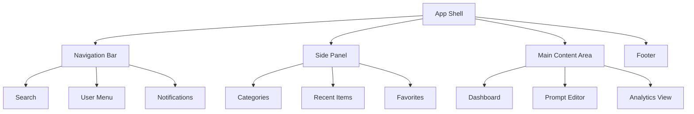

### 5.1.2 Component Specifications

| Component | Description | Interactions |
|-----------|-------------|--------------|
| Navigation Bar | Fixed top bar with primary navigation | - Global search<br>- User profile access<br>- Notification center |
| Side Panel | Collapsible left panel for navigation | - Category browsing<br>- Quick access items<br>- Workspace switching |
| Prompt Editor | Main workspace for prompt creation | - Rich text editing<br>- Real-time preview<br>- Version history |
| Analytics Dashboard | Data visualization interface | - Interactive charts<br>- Custom date ranges<br>- Export capabilities |

### 5.1.3 Responsive Breakpoints

| Breakpoint | Width | Layout Adjustments |
|------------|-------|-------------------|
| Mobile | < 768px | - Stack navigation<br>- Hide side panel<br>- Full-width components |
| Tablet | 768px - 1024px | - Collapsible side panel<br>- Compact navigation<br>- Grid layout |
| Desktop | > 1024px | - Expanded navigation<br>- Visible side panel<br>- Multi-column layout |

## 5.2 DATABASE DESIGN

### 5.2.1 Data Models

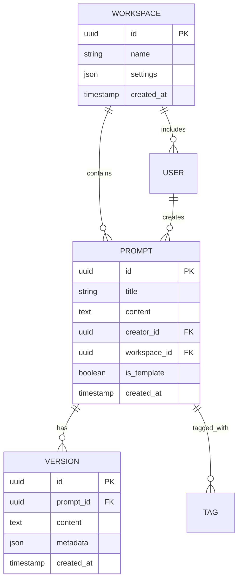

### 5.2.2 Storage Schema

| Collection | Indexes | Partitioning Strategy |
|------------|---------|----------------------|
| workspaces | - workspace_id<br>- created_at | Hash by workspace_id |
| prompts | - prompt_id<br>- workspace_id<br>- creator_id | Hash by workspace_id |
| versions | - version_id<br>- prompt_id | Hash by prompt_id |
| analytics | - prompt_id<br>- timestamp | Range by timestamp |

### 5.2.3 Data Access Patterns

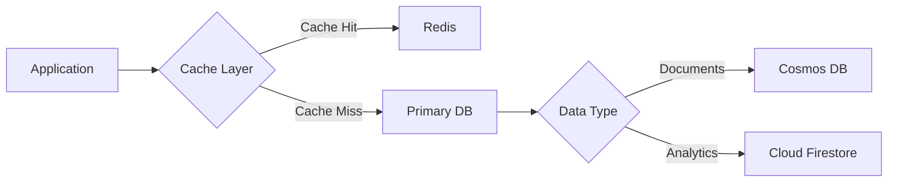

## 5.3 API DESIGN

### 5.3.1 REST Endpoints

| Endpoint | Method | Purpose | Authentication |
|----------|---------|---------|----------------|
| /api/v1/prompts | GET, POST | Prompt management | OAuth 2.0 |
| /api/v1/workspaces | GET, POST | Workspace operations | OAuth 2.0 |
| /api/v1/analytics | GET | Usage statistics | OAuth 2.0 |
| /api/v1/ai/generate | POST | AI model integration | API Key |

### 5.3.2 WebSocket Events

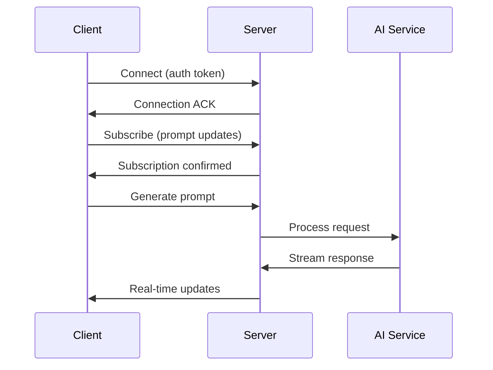

### 5.3.3 Integration Interfaces

```mermaid
flowchart TD
    A[Client] -->|REST| B[API Gateway]
    A -->|WebSocket| C[Real-time Server]
    
    B --> D{Service Router}
    D -->|Prompts| E[Prompt Service]
    D -->|Analytics| F[Analytics Service]
    D -->|AI| G[AI Integration]
    
    C --> H[Event Handler]
    H --> I[Message Queue]
    I --> J[Background Workers]
```

### 5.3.4 API Response Format

```yaml
responses:
  success:
    type: object
    properties:
      status:
        type: string
        enum: [success]
      data:
        type: object
      metadata:
        type: object
        properties:
          timestamp:
            type: string
          version:
            type: string
  error:
    type: object
    properties:
      status:
        type: string
        enum: [error]
      code:
        type: string
      message:
        type: string
```

## 5.4 SECURITY DESIGN

### 5.4.1 Authentication Flow

```mermaid
sequenceDiagram
    participant User
    participant Client
    participant Gateway
    participant Auth
    participant Service
    
    User->>Client: Login Request
    Client->>Auth: OAuth Flow
    Auth->>Client: Access Token
    Client->>Gateway: API Request + Token
    Gateway->>Auth: Validate Token
    Auth->>Gateway: Token Valid
    Gateway->>Service: Authorized Request
    Service->>Gateway: Response
    Gateway->>Client: Protected Data
```

### 5.4.2 Security Controls

| Layer | Control | Implementation |
|-------|---------|----------------|
| Network | TLS 1.3 | - Certificate management<br>- Perfect forward secrecy |
| Application | OAuth 2.0 | - JWT tokens<br>- Scope-based access |
| Data | Encryption | - AES-256 at rest<br>- Field-level encryption |
| API | Rate Limiting | - Per-user quotas<br>- Burst protection |

# 6. USER INTERFACE DESIGN

## 6.1 Layout Components

### 6.1.1 Navigation Structure
```
+--------------------------------------------------+
|  [#] Prompts Portal    [@]Profile  [?]Help  [=]   |
+--------------------------------------------------+
|  +-------------+  +-----------------------------+ |
|  | Categories  |  | Main Content Area           | |
|  | +--AI      |  |                             | |
|  | +--HR      |  |                             | |
|  | +--Sales   |  |                             | |
|  | +--Custom  |  |                             | |
|  |            |  |                             | |
|  | [+] New    |  |                             | |
|  +-------------+  +-----------------------------+ |
+--------------------------------------------------+
```

### 6.1.2 Prompt Editor
```
+--------------------------------------------------+
| Title: [...........................] [Save] [Test] |
+--------------------------------------------------+
| Variables:                                        |
| [x] {name}    [x] {company}    [+] Add Variable  |
+--------------------------------------------------+
| Editor                          | Live Preview    |
|                                |                  |
| Write your prompt here...      | Result will     |
|                                | appear here...   |
|                                |                  |
| [Format] [Variables] [Clear]   | [Refresh]       |
+--------------------------------------------------+
| Analytics:                                        |
| Usage: [====    ] 40%  Success: [======  ] 60%   |
+--------------------------------------------------+
```

### 6.1.3 Dashboard View
```
+--------------------------------------------------+
| Dashboard                        [Export] [Share]  |
+--------------------------------------------------+
| Quick Stats:                                      |
| +---------------+ +---------------+ +------------+ |
| | Total Prompts | | Active Users | | Success    | |
| |     127      | |      45      | |    89%     | |
| +---------------+ +---------------+ +------------+ |
|                                                  |
| Recent Activity:                                 |
| +------------------------------------------------+
| | > Prompt "Sales Script" modified by @john      |
| | > New template added to HR category            |
| | > Analytics report generated                   |
| +------------------------------------------------+
```

## 6.2 Component Key

### Navigation Elements
- [#] Main menu/dashboard
- [@] User profile access
- [?] Help/documentation
- [=] Settings menu
- [<] [>] Navigation arrows
- [+] Add/create new item
- [x] Close/remove item

### Input Controls
- [...] Text input field
- [ ] Checkbox
- ( ) Radio button
- [v] Dropdown menu
- [Button] Action button
- [====] Progress indicator

### Status Indicators
- [!] Warning/alert
- [i] Information
- [$] Payment/billing
- [*] Favorite/important
- [^] Upload function

## 6.3 Interaction Patterns

### 6.3.1 Navigation Flow
```
[Dashboard] ---> [Category List] ---> [Prompt Editor]
                                |
                                ---> [Template Library]
                                |
                                ---> [Analytics View]
```

### 6.3.2 Modal Dialogs
```
+--------------------------------------------------+
|  Confirm Action                             [x]   |
+--------------------------------------------------+
|  Are you sure you want to delete this prompt?     |
|                                                   |
|  [Cancel]                              [Delete]   |
+--------------------------------------------------+
```

## 6.4 Responsive Breakpoints

### 6.4.1 Desktop View (>1024px)
- Full sidebar visible
- Multi-column layout
- Expanded navigation

### 6.4.2 Tablet View (768px-1024px)
- Collapsible sidebar
- Fluid grid layout
- Condensed navigation

### 6.4.3 Mobile View (<768px)
```
+------------------+
| [=] Prompts   [@]|
+------------------+
| [Search...]      |
+------------------+
| Content          |
|                  |
|                  |
+------------------+
| [#] [*] [+] [?] |
+------------------+
```

## 6.5 Theme Support

### 6.5.1 Color Schemes
- Light theme (default)
- Dark theme
- High contrast mode
- Custom brand themes

### 6.5.2 Typography
- Base font size: 16px
- Font family: System default
- Scale ratio: 1.2
- Line height: 1.5

## 6.6 Accessibility Features
- ARIA landmarks
- Keyboard navigation
- Focus indicators
- Screen reader support
- Color contrast compliance
- Scalable text support

# 7. SECURITY CONSIDERATIONS

## 7.1 AUTHENTICATION AND AUTHORIZATION

### 7.1.1 Authentication Flow

```mermaid
sequenceDiagram
    participant User
    participant Client
    participant Gateway
    participant OAuth
    participant Services
    
    User->>Client: Access Request
    Client->>OAuth: Initiate OAuth 2.0 Flow
    OAuth->>User: Login Prompt
    User->>OAuth: Credentials
    OAuth->>Client: Authorization Code
    Client->>Gateway: Exchange Code
    Gateway->>OAuth: Validate Token
    OAuth->>Gateway: Access Token + Refresh Token
    Gateway->>Services: JWT with Claims
    Services->>Client: Protected Resources
```

### 7.1.2 Authorization Matrix

| Role | Prompt Management | Team Management | Analytics | System Settings |
|------|------------------|-----------------|-----------|-----------------|
| Admin | Full Access | Full Access | Full Access | Full Access |
| Team Manager | Create/Edit/Delete | Manage Team | View Team Analytics | No Access |
| Editor | Create/Edit | View Only | View Own Analytics | No Access |
| Viewer | View Only | No Access | View Own Analytics | No Access |

## 7.2 DATA SECURITY

### 7.2.1 Encryption Standards

| Layer | Method | Key Length | Rotation Period |
|-------|---------|------------|----------------|
| Data at Rest | AES-256-GCM | 256-bit | 90 days |
| Data in Transit | TLS 1.3 | 256-bit | 30 days |
| Database Fields | Field-level Encryption | 256-bit | 90 days |
| API Tokens | JWT with RS256 | 2048-bit | 24 hours |

### 7.2.2 Data Protection Flow

```mermaid
flowchart TD
    A[User Data] -->|TLS 1.3| B[API Gateway]
    B -->|Field Encryption| C[Application Layer]
    C -->|AES-256| D[Database]
    
    E[Backup Process] -->|Encrypted| F[Cloud Storage]
    F -->|Geo-Replication| G[Secondary Region]
    
    H[Key Management] -->|Rotation| I[Key Vault]
    I -->|Access Control| B
    I -->|Access Control| C
    I -->|Access Control| D
```

## 7.3 SECURITY PROTOCOLS

### 7.3.1 Security Controls

| Category | Control | Implementation |
|----------|---------|----------------|
| Access Control | OAuth 2.0 + RBAC | - Multi-factor authentication<br>- Role-based permissions<br>- Session management |
| Network Security | WAF + DDoS Protection | - Azure/GCP WAF<br>- Rate limiting<br>- IP whitelisting |
| API Security | API Gateway | - Request validation<br>- Token authentication<br>- Rate limiting |
| Monitoring | Security Information and Event Management (SIEM) | - Real-time monitoring<br>- Threat detection<br>- Audit logging |

### 7.3.2 Security Compliance

| Standard | Requirements | Implementation |
|----------|--------------|----------------|
| GDPR | Data Protection | - Data encryption<br>- Privacy controls<br>- Data deletion capabilities |
| SOC 2 | Security Controls | - Access controls<br>- Monitoring<br>- Incident response |
| OWASP | Web Security | - Input validation<br>- XSS prevention<br>- CSRF protection |

### 7.3.3 Incident Response

```mermaid
stateDiagram-v2
    [*] --> Detection
    Detection --> Analysis
    Analysis --> Containment
    Containment --> Eradication
    Eradication --> Recovery
    Recovery --> PostIncident
    PostIncident --> [*]
    
    Detection: Automated Detection
    Analysis: Threat Assessment
    Containment: Isolate Threat
    Eradication: Remove Threat
    Recovery: Restore Services
    PostIncident: Review & Update
```

### 7.3.4 Security Monitoring

| Monitoring Type | Tools | Metrics |
|----------------|-------|----------|
| Access Monitoring | OAuth Logs | - Login attempts<br>- Failed authentications<br>- Token usage |
| Network Monitoring | WAF Logs | - Request patterns<br>- Attack signatures<br>- Traffic anomalies |
| Application Monitoring | Application Logs | - API usage<br>- Error rates<br>- Security events |
| Database Monitoring | Database Logs | - Access patterns<br>- Query analysis<br>- Data modifications |

# 8. INFRASTRUCTURE

## 8.1 DEPLOYMENT ENVIRONMENT

### Primary Environment: Cloud-Native
```mermaid
flowchart TD
    A[Production Environment] -->|Primary| B[Azure/GCP]
    A -->|Backup| C[Secondary Region]
    
    B --> D[Region 1]
    D --> E[Availability Zone 1]
    D --> F[Availability Zone 2]
    D --> G[Availability Zone 3]
    
    C --> H[Region 2]
    H --> I[Availability Zone 1]
    H --> J[Availability Zone 2]
    H --> K[Availability Zone 3]
```

| Environment Type | Configuration | Purpose |
|-----------------|---------------|----------|
| Production | Multi-AZ, Multi-Region | Primary service delivery |
| Staging | Single Region, Multi-AZ | Pre-production testing |
| Development | Single AZ | Development and testing |
| DR | Secondary Region | Business continuity |

## 8.2 CLOUD SERVICES

| Service Category | Azure | GCP | Purpose |
|-----------------|-------|-----|----------|
| Compute | Azure Kubernetes Service | Google Kubernetes Engine | Container orchestration |
| Database | Cosmos DB | Cloud Firestore | Document storage |
| Cache | Azure Cache for Redis | Cloud Memorystore | Performance optimization |
| Storage | Azure Blob Storage | Cloud Storage | File storage |
| CDN | Azure CDN | Cloud CDN | Content delivery |
| Monitoring | Azure Monitor | Cloud Monitoring | System observability |

## 8.3 CONTAINERIZATION

```mermaid
flowchart LR
    A[Application Code] -->|Dockerfile| B[Container Image]
    B -->|Push| C[Container Registry]
    C -->|Pull| D[Kubernetes Cluster]
    
    subgraph Container Structure
        E[Base Image: Node 20]
        E --> F[App Dependencies]
        F --> G[Application Code]
        G --> H[Configuration]
    end
```

### Container Specifications

| Component | Configuration | Resources |
|-----------|---------------|-----------|
| Frontend | Node.js 20, Nginx | 1 CPU, 2GB RAM |
| API Services | Node.js 20 | 2 CPU, 4GB RAM |
| Analytics Service | Python 3.11 | 2 CPU, 4GB RAM |
| Cache | Redis 7.0 | 2 CPU, 4GB RAM |

## 8.4 ORCHESTRATION

```mermaid
flowchart TD
    A[Kubernetes Cluster] --> B[Node Pool 1]
    A --> C[Node Pool 2]
    A --> D[Node Pool 3]
    
    B --> E[Frontend Pods]
    C --> F[API Pods]
    D --> G[Analytics Pods]
    
    H[Ingress Controller] --> E
    H --> F
    H --> G
    
    I[Auto Scaler] --> B
    I --> C
    I --> D
```

### Kubernetes Configuration

| Resource | Configuration | Scaling Policy |
|----------|---------------|----------------|
| Frontend Deployment | 3-10 replicas | CPU > 70% |
| API Deployment | 3-15 replicas | Request count |
| Analytics Deployment | 2-8 replicas | Queue length |
| Cache StatefulSet | 3 replicas | Manual |

## 8.5 CI/CD PIPELINE

```mermaid
flowchart LR
    A[Source Code] -->|Git Push| B[GitHub Actions]
    B --> C{Tests}
    C -->|Pass| D[Build Container]
    C -->|Fail| E[Notify Team]
    D --> F[Push to Registry]
    F --> G{Environment}
    G -->|Dev| H[Dev Cluster]
    G -->|Staging| I[Staging Cluster]
    G -->|Prod| J[Production Cluster]
```

### Pipeline Stages

| Stage | Tools | Actions |
|-------|-------|---------|
| Source Control | GitHub | Code versioning, branch protection |
| CI | GitHub Actions | Build, test, security scan |
| Artifact Management | Azure CR/GCR | Container image storage |
| CD | ArgoCD | Kubernetes deployment |
| Monitoring | Prometheus/Grafana | Deployment health checks |

### Deployment Strategy

| Environment | Strategy | Rollback Time |
|-------------|----------|---------------|
| Development | Direct deployment | Immediate |
| Staging | Blue/Green | < 5 minutes |
| Production | Canary | < 10 minutes |

# 9. APPENDICES

## 9.1 Additional Technical Information

### Document Learning Capabilities
```mermaid
flowchart TD
    A[Document Upload] -->|Parse| B[Text Extraction]
    B -->|Process| C[Knowledge Base]
    C -->|Index| D[Vector Database]
    D -->|Enhance| E[Prompt Templates]
    
    B -->|Extract| F[Key Concepts]
    F -->|Generate| G[Custom Variables]
    G -->|Populate| E
    
    E -->|Optimize| H[AI-Enhanced Prompts]
```

### Frontend Monitoring Implementation

| Metric Type | Tool | Implementation |
|------------|------|----------------|
| Page Views | Google Analytics 4 | gtag.js snippet |
| User Flow | GA4 Enhanced Measurement | Route change tracking |
| Performance | Web Vitals | Core Web Vitals tracking |
| Error Tracking | GA4 Exception Events | Global error handler |

### User Engagement Analytics

| Feature | Tool | Metrics |
|---------|------|---------|
| Prompt Usage | Mixpanel | - Usage frequency<br>- Completion rates<br>- Time spent editing |
| User Journey | Amplitude | - Feature adoption<br>- Drop-off points<br>- Session duration |
| Team Collaboration | Custom Analytics | - Sharing patterns<br>- Template usage<br>- Workspace activity |

## 9.2 Glossary

| Term | Definition |
|------|------------|
| Prompt Engineering | The practice of crafting and optimizing input text for AI language models |
| Vector Database | Specialized database for storing and querying high-dimensional vectors representing text or data |
| Template Variable | Dynamic placeholder in prompt templates that can be customized per use case |
| Workspace | Isolated environment for team collaboration and prompt management |
| Rate Limit | Maximum number of API requests allowed within a specific timeframe |
| Canary Deployment | Gradual rollout of new features to a subset of users |
| Blue/Green Deployment | Deployment strategy using two identical environments for zero-downtime updates |
| Core Web Vitals | Google's metrics for measuring web page experience |

## 9.3 Acronyms

| Acronym | Full Form |
|---------|-----------|
| AI | Artificial Intelligence |
| API | Application Programming Interface |
| CDN | Content Delivery Network |
| CI/CD | Continuous Integration/Continuous Deployment |
| CRUD | Create, Read, Update, Delete |
| DNS | Domain Name System |
| ETL | Extract, Transform, Load |
| FCP | First Contentful Paint |
| GDPR | General Data Protection Regulation |
| gRPC | Google Remote Procedure Call |
| HTTP | Hypertext Transfer Protocol |
| IDE | Integrated Development Environment |
| JWT | JSON Web Token |
| KPI | Key Performance Indicator |
| LLM | Large Language Model |
| MFA | Multi-Factor Authentication |
| MTBF | Mean Time Between Failures |
| MTTR | Mean Time To Recovery |
| OAuth | Open Authorization |
| RBAC | Role-Based Access Control |
| REST | Representational State Transfer |
| ROI | Return on Investment |
| SDK | Software Development Kit |
| SLA | Service Level Agreement |
| SQL | Structured Query Language |
| SSO | Single Sign-On |
| TLS | Transport Layer Security |
| UI/UX | User Interface/User Experience |
| URL | Uniform Resource Locator |
| UUID | Universally Unique Identifier |
| VM | Virtual Machine |
| VPC | Virtual Private Cloud |
| WAF | Web Application Firewall |
| WCAG | Web Content Accessibility Guidelines |
| XSS | Cross-Site Scripting |